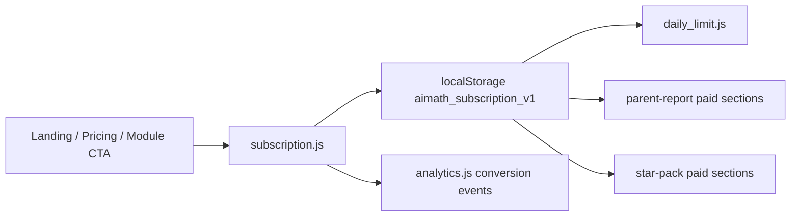
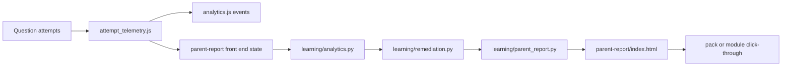
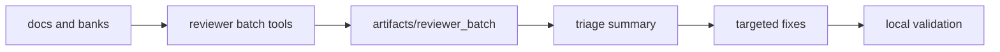

# Monetization MVP Audit

> Updated: 2026-03-10
> Scope: audit the current ai-math-web monetization stack against the existing repo, not a greenfield plan.

## Executive Summary

This repo is not missing a monetization MVP. It already has the main surfaces needed to validate paid demand:

- conversion pages and upgrade CTAs
- subscription state and feature gating
- local-first analytics and KPI views
- star-pack content positioning for the four target topics
- parent report and remediation pipeline
- reviewer automation for iterative quality improvement

The current bottleneck is not UI breadth. It is trustworthiness and durability of the loop:

1. payment is still mock-first on the web flow
2. subscription and analytics still rely too heavily on client storage
3. parent-report cloud sync still has a client-side secret risk
4. reviewer automation exists, but a narrower sub test agent for hint clarity, child readability, and parent-report clarity is still missing

Bottom line: the repo already supports a 90-day validation MVP. The next work should harden the loop and make measurement trustworthy, not rebuild the product surface.

## Verified Frontend Surfaces

### Core conversion routes

| Route | Role | Key files |
|---|---|---|
| `/` | parent/student landing and CTA entry | `docs/index.html`, `docs/shared/abtest.js`, `docs/shared/analytics.js` |
| `/pricing/` | plan comparison and trial or checkout trigger | `docs/pricing/index.html`, `docs/shared/subscription.js` |
| `/star-pack/` | flagship paid value framing for four topics | `docs/star-pack/index.html`, `docs/shared/subscription.js`, `docs/shared/analytics.js` |
| `/parent-report/` | parent-facing paid value surface | `docs/parent-report/index.html`, `docs/shared/student_auth.js`, `docs/shared/subscription.js` |
| `/kpi/` | internal funnel and event inspection | `docs/kpi/index.html`, `docs/shared/analytics.js`, `docs/shared/abtest.js` |

### Shared monetization modules

| File | Current role |
|---|---|
| `docs/shared/subscription.js` | front-end plan state machine, trial, checkout_pending, mock confirm payment, plan checks |
| `docs/shared/daily_limit.js` | free-tier daily cap logic |
| `docs/shared/daily_limit_wire.js` | attaches daily limit behavior across modules |
| `docs/shared/upgrade_banner.js` | generic upgrade CTA placement |
| `docs/shared/completion_upsell.js` | end-of-flow upsell, currently stronger on empire-style modules |
| `docs/shared/student_auth.js` | student identity and parent PIN local flow with cloud sync hooks |
| `docs/shared/analytics.js` | local-first event logger, query helpers, KPI aggregation |
| `docs/shared/attempt_telemetry.js` | per-question attempt bridge into analytics-style events |
| `docs/shared/abtest.js` | front-end A/B assignment and conversion correlation |

## Verified Learning and Backend Extension Points

### Learning and report pipeline

| File | Role |
|---|---|
| `learning/analytics.py` | analytics aggregation for a student |
| `learning/remediation.py` | remediation-plan generation |
| `learning/parent_report.py` | report assembly from analytics and remediation |
| `learning/service.py` | service wrapper used by the rest of the app |
| `learning/db.py` | analytics and remediation persistence tables |

### Backend hooks already present

`server.py` already contains real extension points for paid access beyond the front-end mock flow:

- subscriptions table creation
- subscription-active gate checks
- `/v1/app/auth/provision`
- `/v1/app/auth/login`
- `/v1/app/auth/whoami`
- gated endpoints that already call subscription enforcement
- `/app-login` page for purchased accounts

This means the repo is not blocked by missing backend shape. It is blocked by the work of wiring the public web monetization flow to these server-backed controls.

## Content and Scenario Fit

The product brief asked for four commercial anchors: fractions, decimals, percentages, and life applications. The repo already maps cleanly to them.

| Theme | Existing module surfaces |
|---|---|
| Fractions | `docs/fraction-g5/`, `docs/fraction-word-g5/`, `docs/commercial-pack1-fraction-sprint/` |
| Decimals | `docs/interactive-decimal-g5/`, `docs/decimal-unit4/` |
| Percentages and ratios | `docs/ratio-percent-g5/` |
| Life applications | `docs/life-applications-g5/`, `docs/interactive-g5-life-pack1-empire/`, `docs/interactive-g5-life-pack1plus-empire/`, `docs/interactive-g5-life-pack2-empire/`, `docs/interactive-g5-life-pack2plus-empire/` |

Commercial conclusion: the content side is already good enough for MVP validation. More value will come from packaging, progress signaling, and report-to-practice return loops than from creating more raw content.

## Current Data Flow

### Conversion and access loop

### Parent value loop

### Iteration quality loop

## Known State and Storage

Verified storage keys in current architecture:

- `aimath_subscription_v1`
- `aimath_analytics_v1`
- `aimath_daily_limit_v1`
- `aimath_student_auth_v1`
- `aimath_session_id`
- `ai_math_attempts_v1::<user_id>`

Pragmatic implication: the MVP is measurable for local and pilot usage, but not yet trustworthy enough for long-lived cohort analysis or production billing state.

## What Is Already Working

### 1. Paid story exists

The repo already presents a coherent free vs paid story:

- free tier limits via daily usage control
- plan comparison on pricing
- gated premium sections in parent report and star pack
- repeated upgrade entry points on landing and learning flows

### 2. Measurement exists

The analytics layer is not hypothetical. It already supports:

- conversion steps
- event querying
- KPI aggregation
- A/B variant assignment and correlation
- attempt-level question telemetry bridging

### 3. Parent value exists

The parent report is not a placeholder. It already exposes:

- summary framing
- weak-skill style analysis
- remediation-oriented suggestions
- gated premium framing

### 4. Review automation exists

The repo already includes quality automation around content and solution clarity. The latest reviewer gate is green again after hint-ladder fixes, which is a good baseline for monetization work because child trust depends on explanation quality.

## What Is Not Done Yet

### P0 gaps

1. The web payment path is still mock-heavy and does not represent a real provider-backed purchase lifecycle.
2. Cloud sync security for parent-report data still needs hardening, especially any client-side secret exposure pattern.
3. A dedicated sub test agent for solution-logic clarity, hint readability, parent-report readability, and diagram appropriateness is not yet separated from the generic reviewer loop.

### P1 gaps

1. Subscription state is not yet fully server-backed for the public web flow.
2. Analytics durability is still too local-first for reliable cohort analysis.
3. Upsell behavior is stronger in empire-style modules than in the rest of the practice surfaces.
4. Topic and plan enrichment should be made fully consistent across all conversion and practice events.

### P2 gaps

1. More granular pack completion summaries and outcome cards can be added.
2. Retry-specific telemetry can be formalized where UX supports it.
3. Grade-parameterized expansion can be planned after the G5-G6 monetization loop is proven.

## Audit Conclusion

The repo already has the right architecture for a validation MVP:

- conversion entry
- pricing and plan logic
- learning-time gating
- parent-value surface
- scenario packs
- analytics and A/B instrumentation
- backend auth and subscription hooks
- reviewer-based iteration tooling

The next 90 days should therefore focus on four practical outcomes:

1. replace mock billing assumptions with a provider-backed path
2. move subscription and sensitive report sync concerns behind server control
3. make analytics durable enough for cohort and conversion truth
4. add a dedicated sub test agent loop that protects explanation quality for children and report clarity for parents

See `MVP_GAP_LIST.md`, `ROADMAP_12_WEEKS.md`, and `MONETIZATION_8H_ITERATION_PLAN.md` for the execution order.
